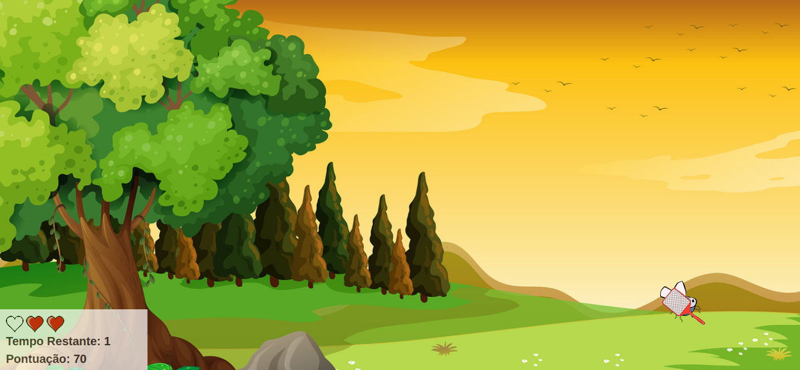
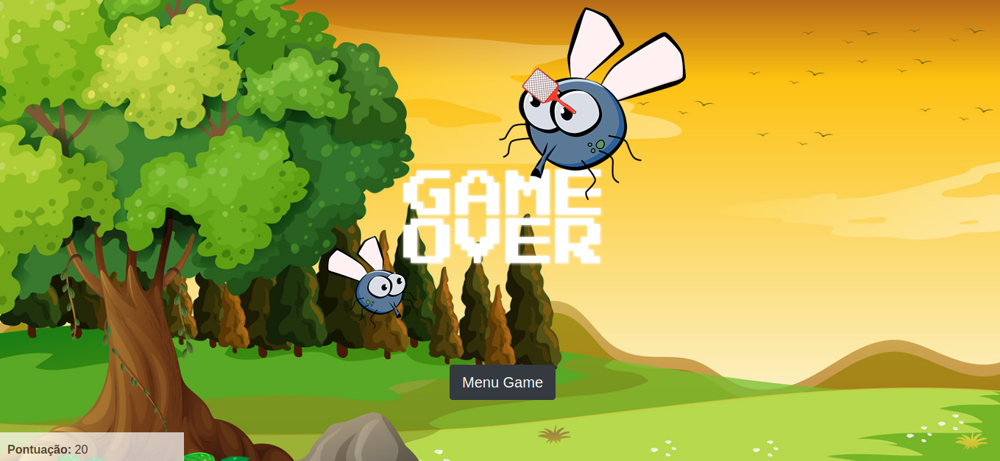

## Jogo Mata Mosquito

#### Descrição do projeto
> Esse Projeto foi desenvolvido no curso: _Desenvolvimento Web_
>
> Instrutor: _Jorge Sant Ana_
>
> Melhorado por mim: Vando Dos Reis

#### Tecnologias usadas no projeto
>_JavaScript_  
>_Boostratp 4_  
>_Html_  
>_Css_  

## Imagens do jogo

>__Menu do game__
> Apresenta oa jogador a opção de escolher a dificuldade.  
>
>
>__Gameplay__
> Aqui é a imagem do gameplay onde o desafio desse game fica na velocidade o mosquito vai desaparecer.  
>
>
>__Vitoria__
> Caso o jogador sobreviva até o tempo acabar, ele vencera o jogo.  
>
>
>__Game Over__
> Após o jogador perder as 3 vidas aparece essa tela de game over e o botão para voltar ao menu.  
>  
